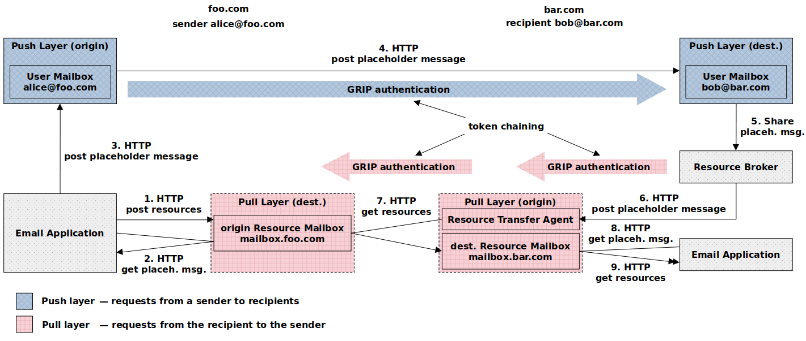

## Introduction

Despite the importance of email infrastructure, the whole ecosystem still relies on more than 40-year-old push-based architecture and protocol design. While conceptually sound as a means of communication, the email system is structurally obsolete and functionally deficient.

Cargomail, a revised email system, utilizes an architecture with push and pull request layers to separate a mailbox (locator) from an email address (identifier). The primary benefits of using this architecture include:

* Mailbox Portability—the ability to move a mailbox from one hosting partner to another without changing your email address.
* Enhanced Spam Protection—the separated identifier and the locator allow for a more detailed assessment of the sender's reputation.
* Content of Any Size or Quantity—the capability to exchange large volumes of documents, images, videos, and audio of unlimited size.

<!--## White Paper

This project is constantly evolving. You can download the latest revision of the whitepaper here: [Cargomail.pdf](https://github.com/cargomail-org/cargomail/raw/main/whitepaper/Cargomail.pdf).-->

## Architecture

The Cargomail architecture separates the mailbox from the email address. It uses a mechanism of push-then-pull requests over different routes to enable data exchange between mailboxes. This mechanism has the potential to address privacy and attachment issues more effectively than the current push-only email system. An additional pull layer facilitates the efficient transfer of data of any size. The architecture enhances the [Internet Mail Architecture, IETF RFC 5598](https://www.rfc-editor.org/rfc/rfc5598.html).



#### *Key Points*

• Each email consists of a <i>placeholder message</i> created in the <i>mailbox</i> and related external resources (message bodies) stored in the same <i>mailbox</i>. The <i>placeholder message</i> also acts as an access control list to its external body resources.

• The body resources owned by the author, stored in the origin <i>mailbox</i> (mailbox&#46;foo&#46;com), are temporarily shared with recipients. Following a successful sharing process, a <i>placeholder message</i> is sent to each recipient through the push layer. The <i>placeholder message</i> contains the origin <i>mailbox</i> URL, the cryptographic hash values of the referenced body resources (Content-IDs), and the category of correspondence, e.g., personal, business, or healthcare (see Appendix A for a <i>placeholder message</i> example).

• After receiving the <i>placeholder message</i>, the recipient's Message Delivery Agent (MDA) determines (according to the user's preferences and the category of correspondence) which destination <i>mailbox</i> will be used for communication. Once the destination <i>mailbox</i> (mailbox&#46;bar&#46;com) is determined, the MDA adds the header with the destination <i>mailbox</i> URL to the <i>placeholder message</i> and delivers it to the resolved destination <i>mailbox</i> using the [GRIP](grip) authentication mechanism.

• The Resource Fetch Agent (RFA) at the destination server gets the origin <i>mailbox</i> URL and the cryptographic hash values of the referenced body resources in the <i>placeholder message</i>. Using the GRIP authentication mechanism, the agent tries to fetch the external body resources from the origin <i>mailbox</i>. After successful authentication, the data is fetched and stored in the destination <i>mailbox</i>. Finally, the <i>email application</i> gets the relevant data from the destination <i>mailbox</i> and reconstructs the original message according to the <i>placeholder message</i> template.

## Appendix A—Placeholder Message

Here is a placeholder message in JSON format with external bodies accessible via content-addressed URIs.

```yaml
{
  "headers":
    {
      "X-Origin-Resource-Mailbox-URL": "mailbox.foo.com",
      "X-Destination-Resource-Mailbox-URL": "mailbox.bar.com",
      "From": "Alice Sanders <alice@foo.com>",
      "Subject": "Meeting",
      "To": "Bob Sanders <bob@bar.com>",
      "Cc": "Carol <carol@bar.com>, Daniel <dan@bar.com>",
      "Date": "Tue Sep 19 20:52:05 CEST 2023",
      "Message-ID": "<b07d0cdf-c6f4-4f67-b24c-cc847a4c2df4@foo.com>",
      "X-Thread-ID": "<68fb9177-6853-466a-8f7d-c96fbb885f81@foo.com>",
      "X-Correspondence-Category": "primary",
      "Content-Type": "multipart/mixed",
    },
  "parts":
    [
      {
        "headers": { "Content-Type": "multipart/alternative" },
        "parts":
          [
            {
              "headers":
                {
                  "Content-Disposition": "inline",
                  "Content-ID": "<aSQnmlBT6RndpDnwTSStJUVhlh9XL9_y2QXX42NhKuI>",
                  "Content-Type":
                    [
                      'message/external-body; access-type="x-content-addressed-uri"; hash-algorithm="sha256"; size="42"',
                      "text/plain; charset=UTF-8",
                    ],
                },
            },
            {
              "headers":
                {
                  "Content-Disposition": "inline",
                  "Content-ID": "<Y_ION3g8WQuqGzhsDlVrhAgQ0D7AbXu9T-HSv3w--zY>",
                  "Content-Type":
                    [
                      'message/external-body; access-type="x-content-addressed-uri"; hash-algorithm="sha256"; size="109"',
                      "text/html; charset=UTF-8",
                    ],
                },
            },
          ],
      },
      {
        "headers": { "Content-Type": "multipart/mixed" },
        "parts":
          [
            {
              "headers":
                {
                  "Content-Disposition": 'attachment; filename="cargomail_architecture.svg"',
                  "Content-ID": "<1pzyqfFWbfhJ3hrydjL9jO9Qgeg70TgZQ_zpOkt4HOU>",
                  "Content-Type":
                    [
                      'message/external-body; access-type="x-content-addressed-uri"; hash-algorithm="sha256"; size="52247"',
                      "image/svg+xml",
                    ],
                },
            },
            {
              "headers":
                {
                  "Content-Disposition": 'attachment; filename="Cargomail.pdf"',
                  "Content-ID": "<6G6Mkapa3-Om7B6BVhPUBEsCLP6t6LAVP4bHxhQF5nc>",
                  "Content-Type":
                    [
                      'message/external-body; access-type="x-content-addressed-uri"; hash-algorithm="sha256"; size="153403"',
                      "application/pdf",
                    ],
                },
            },
          ],
      },
    ],
}
```
