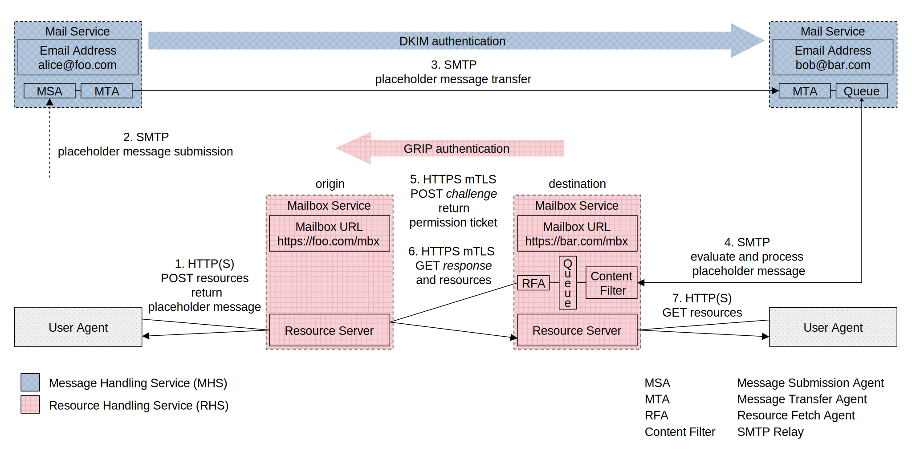
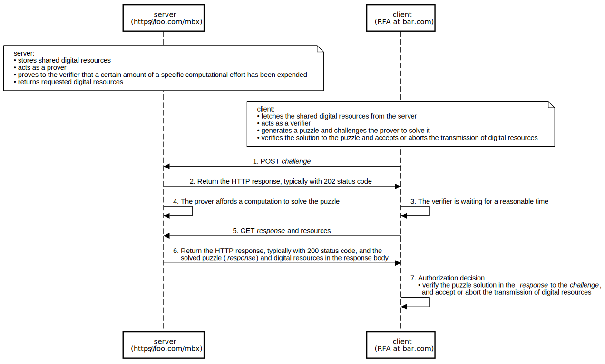

# Cargomail

## Introduction

Despite the importance of the email infrastructure, the entire ecosystem still relies on a push-based architecture and protocol design that is more than 40 years old. While conceptually sound as a means of communication, the Internet mail system is structurally outdated and functionally deficient.

Cargomail introduces a revised Internet mail architecture that includes a new Resource Handling Service (RHS) alongside the existing Message Handling Service (MHS). The RHS performs data exchange between resource servers. These servers store email message bodies, including attachments. Such an architecture offers several benefits, including advanced anti-spam protection that uses a challenge-response mechanism to ensure that only legitimate messages are delivered to the recipient. The challenge-response mechanism requires a certain amount of computational effort on the sender's part to make bulk spamming costly. It means that anyone can send you an email, but those who want to spread spam in large quantities will find it difficult and time-consuming. Additionally, this architecture allows for the exchange of large volumes of documents, images, videos, and audio files of unlimited size, making it a versatile and efficient way to handle email communication.

<!--
## White Paper

This project is constantly evolving. You can download the latest revision of the whitepaper here: [Cargomail.pdf](https://github.com/cargomail-org/cargomail/raw/main/whitepaper/Cargomail.pdf).
-->

## Revised Internet Mail Architecture

This section proposes a revised version of the [Internet Mail Architecture, IETF RFC 5598](https://www.rfc-editor.org/rfc/rfc5598.html). The revised architecture separates the mailbox from the email address and uses a mechanism of data push-then-pull over different routes to enable direct data exchange between resource servers. The extra data-pull request layer consists of servers, agents, and protocols. Together, they form the RHS that allows the resource owner (author) control over access to their digital resources through the use of email messages. The RHS extends the capabilities of the current Internet mail system, and has the potential to address spam and attachment issues more effectively than the MHS-only email system.



<p class="figure">
    Fig.&nbsp;1.&emsp;The revised Internet mail architecture
</p>

#### *Key Points*

Each email object consists of a *placeholder message* and associated external resources (message bodies) stored on the Resource Server (RS) of the respective *mailbox service*. The *placeholder message* also functions as an access control list for its external body resources. The information flow illustrated in the Figure 1 includes the following key points:

- The body resources owned by the author stored on the RS of the origin *mailbox service* are temporarily shared with recipients by creating a *placeholder message* which also acts as an access control list. Following a successful sharing process, the *placeholder message* is sent to each recipient through the MHS. This *placeholder message* stores, in its headers, the URL of the origin *mailbox service* and the cryptographic hash values of the referenced body resources (see Appendix A for a *placeholder message* example).

- After receiving the *placeholder message*, the recipient's Message Transfer Agent (MTA) stores it in the mail queue. From there, the *placeholder message* is delivered to a content filter using an SMTP connection. The content filter adds a header containing the destination *mailbox service* URL to the *placeholder message* and filters out the list of referenced body resources based on predefined rules. The resulting list is then stored in the *mailbox service* queue. The *placeholder message* is sent back to the *mail service*, where it is further processed in the standard way, see [Postfix After-Queue Content Filter](https://www.postfix.org/FILTER_README.html#advanced_filter).

- The Resource Fetch Agent (RFA) running on the destination *mailbox service* retrieves the URL of the origin *mailbox service* and the cryptographic hash values of the referenced body resources from the filtered list stored in the destination *mailbox service* queue. Using the [GRIP](https://github.com/cargomail-org/grip) authentication mechanism, the agent attempts to fetch the external body resources from the RS of the origin *mailbox service*. After successful authentication, the data is fetched and stored on the RS of the destination *mailbox service*. Finally, the *user agent* retrieves the relevant data from the RS of the destination *mailbox service* and reconstructs the original message according to the *placeholder message* source.

#### *Anti-Spam Protection*

Challenge–response authorization

TBD



## Appendix A—Placeholder Message

Here is a placeholder message in JSON format with external bodies accessible via content-addressed URIs.

```yaml
{
  "headers":
    {
      "X-Mailbox-Service-Origin-URL": "https://foo.com/mbx",
      "X-Mailbox-Service-Destination-URL": "https://bar.com/mbx",
      "From": "Alice Sanders <alice@foo.com>",
      "Subject": "Meeting",
      "To": "Bob Sanders <bob@bar.com>",
      "Cc": "Carol <carol@bar.com>, Daniel <dan@bar.com>",—
      "Date": "Tue Sep 19 20:52:05 CEST 2023",
      "Message-ID": "<b07d0cdf-c6f4-4f67-b24c-cc847a4c2df4@foo.com>",
      "X-Thread-ID": "<68fb9177-6853-466a-8f7d-c96fbb885f81@foo.com>",
      "Content-Type": "multipart/mixed",
    },
  "parts":
    [
      {
        "headers": { "Content-Type": "multipart/alternative" },
        "parts":
          [
            {
              "headers":
                {
                  "Content-Disposition": "inline",
                  "Content-ID": "<aSQnmlBT6RndpDnwTSStJUVhlh9XL9_y2QXX42NhKuI>",
                  "Content-Type":
                    [
                      'message/external-body; access-type="x-content-addressed-uri"; hash-algorithm="sha256"; size="42"',
                      "text/plain; charset=UTF-8",
                    ],
                },
            },
            {
              "headers":
                {
                  "Content-Disposition": "inline",
                  "Content-ID": "<Y_ION3g8WQuqGzhsDlVrhAgQ0D7AbXu9T-HSv3w--zY>",
                  "Content-Type":
                    [
                      'message/external-body; access-type="x-content-addressed-uri"; hash-algorithm="sha256"; size="109"',
                      "text/html; charset=UTF-8",
                    ],
                },
            },
          ],
      },
      {
        "headers": { "Content-Type": "multipart/mixed" },
        "parts":
          [
            {
              "headers":
                {
                  "Content-Disposition": 'attachment; filename="cargomail_architecture.svg"',
                  "Content-ID": "<1pzyqfFWbfhJ3hrydjL9jO9Qgeg70TgZQ_zpOkt4HOU>",
                  "Content-Type":
                    [
                      'message/external-body; access-type="x-content-addressed-uri"; hash-algorithm="sha256"; size="52247"',
                      "image/svg+xml",
                    ],
                },
            },
            {
              "headers":
                {
                  "Content-Disposition": 'attachment; filename="Cargomail.pdf"',
                  "Content-ID": "<6G6Mkapa3-Om7B6BVhPUBEsCLP6t6LAVP4bHxhQF5nc>",
                  "Content-Type":
                    [
                      'message/external-body; access-type="x-content-addressed-uri"; hash-algorithm="sha256"; size="153403"',
                      "application/pdf",
                    ],
                },
            },
          ],
      },
    ],
}
```

- X-Mailbox-Service-Origin-URL: *Mailbox Service* origin URL
- X-Mailbox-Service-Destination-URL: *Mailbox Service* destination URL
- Contentd-ID: cryptographic hash value of the referenced body resource
