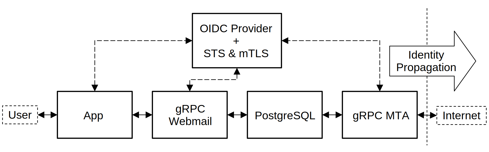

# Fedemail server & app

A gRPC MTA proof of concept.

# Architecture

Fig.&nbsp;1.&emsp;Fedemail Architecture

# Acknowledgments

As of September 2022, the following resources have been used to develop the gRPC MTA proof of concept:

* Gmail API [documentation](https://developers.google.com/gmail/api/reference/rest), licensed under the Creative Commons Attribution 4.0 License, has been used to design a gRPC interface between the webmail application and the backend service.

* Zitadel [OpenID Connect SDK](https://github.com/zitadel/oidc), licensed under the Apache-2.0 License, has been adapted to meet the [Identity Propagation and Assertions](https://github.com/federizer/identity-propagation-and-assertions) concept.

* Linbox, a Google Inbox-inspired [webmail client](https://github.com/yanglin5689446/linbox) licensed under the DO WHAT THE FUCK YOU WANT TO PUBLIC LICENSE, was cloned to speed up the webmail application development. The source code has been heavily customized to be aligned with the gRPC MTA proof of concept.

* Plug-and-play [react package](https://github.com/soofstad/react-oauth2-pkce) for OAuth2 Authorization Code flow with PKCE, licensed under MIT License, enables web application integration with OpenID Connect providers.