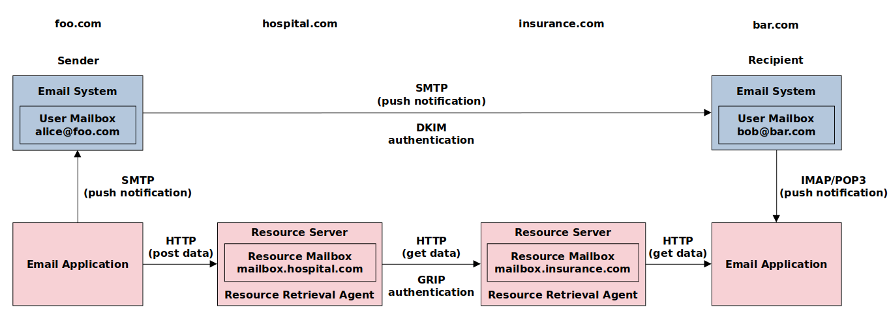

# Email

Email is the most pervasive form of business information exchange. Email is often used not only as an interpersonal communication tool but also as the default choice to send files. Over time, your inbox becomes a personal knowledge repository of what was sent by whom and when. Such an email repository has one fundamental flaw. Due to the design principle of the email system, the email cannot contain large messages. Thus, users often send links to external files instead of attachments or inline images. Links may expire with time, and external files can change. Consequently, your knowledge repository gradually deteriorates.

# Cargomail

Cargomail uses an advanced web editor, which allows users to embed documents, images, and videos in the message body while keeping the respective resource data in the mailbox file storage. The newly designed [Intermodal Message Transfer Agent (IMTA)](https://github.com/cargomail-org/imta) enables the transfer of email messages and their resources in two modes — push and pull. The sender's IMTA sends email messages to the recipient's IMTA, which pulls the respective email resources via the sender's IMTA. This concept allows transferring of a massive amount of data without the risk of receiving spam.

In addition, the Cargomail client has two valuable features:

First, it uses Google's Inbox concept, when emails act as a task queue to get things done.
Second, it uses Meta's Lexical web editor with extensible functionality, e.g., hashtags and mentions.

# Architecture

Fig.&nbsp;1.&emsp;Cargomail Architecture

# Acknowledgments

As of December 2022, the following resources have been used to develop the Cargomail project:

* Gmail API [documentation](https://developers.google.com/gmail/api/reference/rest), licensed under the Creative Commons Attribution 4.0 License, has been used to design a gRPC interface between the webmail application and the backend service.

* Zitadel [OpenID Connect SDK](https://github.com/zitadel/oidc), licensed under the Apache-2.0 License, has been adapted to meet the [Identity Propagation and Assertions](https://github.com/cargomail-org/identity-propagation-and-assertions) concept.

* Linbox, a Google Inbox-inspired [webmail client](https://github.com/yanglin5689446/linbox) licensed under the DO WHAT THE FUCK YOU WANT TO PUBLIC LICENSE, was cloned to speed up the webmail application development. The source code has been heavily customized to be aligned with the gRPC MTA proof of concept.

* A set of [react components](https://github.com/AxaGuilDEv/react-oidc) that enables web application integration with OpenID Connect (OIDC) providers. A Service Worker is responsible for obtaining tokens from the OIDC server and making requests to the resource server. Components are licensed under MIT License.

* Lexical, Meta's [extensible text editor framework](https://github.com/facebook/lexical), licensed under MIT License.

* TUS, [Resumable File Uploads](https://github.com/tus), an open protocol for resumable file uploads.
