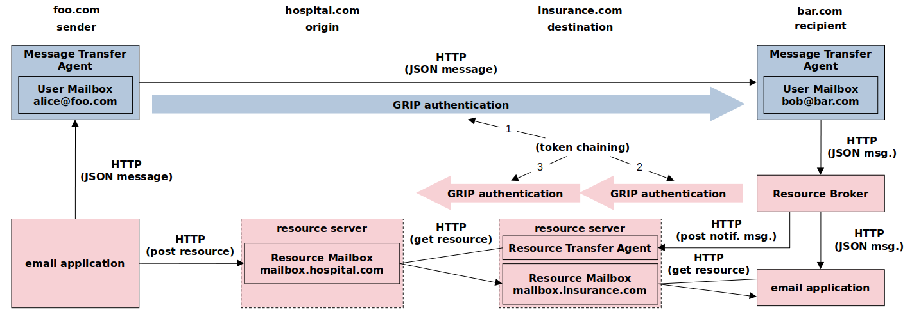

## Notice

Please do not use the code from this repo, as it is unlikely to function properly.

## White Paper

This project is constantly evolving. You can download the latest revision (draft) of the whitepaper here: [Cargomail.pdf](https://github.com/cargomail-org/cargomail/raw/main/whitepaper/Cargomail.pdf). The revised architecture eliminates the hassle of using the existing email infrastructure.

## Architecture



## JSON email message

```yaml
{
  "headers": {
    "X-Origin-Resource-Mailbox-URL": "mailbox.cargomail.org",
    "X-Destination-Resource-Mailbox-URL": "mailbox.cargomail.org",
    "From": "Alice Sanders <alice@cargomail.org>",
    "Subject": "Meeting",
    "To": "Bob Sanders <bob@cargomail.org>",
    "Cc": "Carol <carol@cargomail.org>, Daniel <dan@cargomail.org>",
    "Date": "Tue Sep 19 20:52:05 CEST 2023",
    "Message-ID": "<b07d0cdf-c6f4-4f67-b24c-cc847a4c2df4@cargomail.org>",
    "X-Thread-ID": "<68fb9177-6853-466a-8f7d-c96fbb885f81@cargomail.org>",
    "Content-Type": "multipart/mixed"},
  "parts": [
    {
      "headers": {
        "Content-Type": "multipart/alternative"
      },
      "parts": [
        {
          "headers": {
            "Content-Transfer-Encoding": "base64",
            "Content-Type": "text/plain; charset=UTF-8"
          },
          "body": {
            "data": "SGkgYWxsLArCoApNZWV0aW5nIGF0IDRwbS4KClJlZ2FyZHMKCi1BbGljZQ=="
          }
        },
        {
          "headers": {
            "Content-Transfer-Encoding": "base64",
            "Content-Type": "text/html; charset=UTF-8"
          },
          "body": {
            "data": "PGRpdj5IaSBhbGwsPC9kaXY+PGRpdj4mbmJzcDs8L2Rpdj48ZGl2Pk1lZXRpbmcgYXQgPHN0cm9uZz40cG08L3N0cm9uZz4uPC9kaXY+PHA+UmVnYXJkczwvcD48ZGl2Pi1BbGljZTwvZGl2Pg=="
          }
        }
      ]
    },
    {
      "headers": {
        "Content-Type": "multipart/mixed"
      },
      "parts": [
        {
          "headers": {
            "Content-Disposition": "attachment; filename=\"cargomail_architecture.svg\"",
            "Content-ID": "<1pzyqfFWbfhJ3hrydjL9jO9Qgeg70TgZQ_zpOkt4HOU>",
            "Content-Type": [
              "message/external-body; access-type=\"x-content-addressed-uri\"; hash-algorithm=\"sha256\"; size=\"52247\"",
              "image/svg+xml"
            ]
          }
        },
        {
          "headers": {
            "Content-Disposition": "attachment; filename=\"Cargomail.pdf\"",
            "Content-ID": "<6G6Mkapa3-Om7B6BVhPUBEsCLP6t6LAVP4bHxhQF5nc>",
            "Content-Type": [
              "message/external-body; access-type=\"x-content-addressed-uri\"; hash-algorithm=\"sha256\"; size=\"153403\"",
              "application/pdf"
            ]
          }
        }
      ]
    }
  ]
}
```
