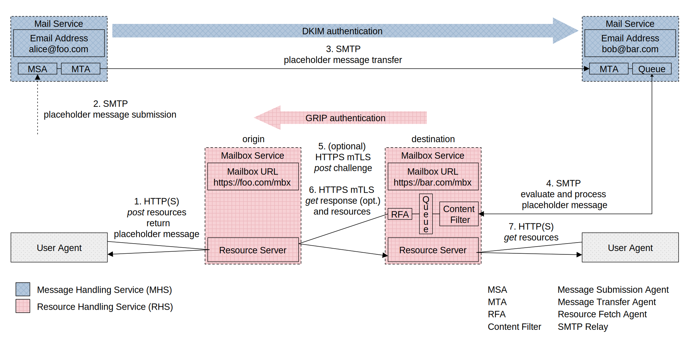

# Cargomail

## Introduction

Despite the importance of the email infrastructure, the entire ecosystem still relies on a push-based architecture and protocol design that is more than 40 years old. While conceptually sound as a means of communication, the Internet Mail system is structurally outdated and functionally deficient.

Cargomail introduces a [revised Internet Mail architecture](#revised-internet-mail-architecture) that includes a new Resource Handling Service (RHS) alongside the existing Message Handling Service (MHS). The RHS performs data exchange between resource servers. These servers store email message bodies, including attachments. Such an architecture offers several benefits, including advanced anti-spam protection that uses a challenge-response mechanism to ensure that only legitimate messages are delivered to the recipient. The challenge-response mechanism requires a certain amount of computational effort on the sender's part to make bulk spamming costly. This means that while anyone can send you an email, those who want to spread spam en masse will find it difficult and time-consuming to do so. Additionally, this architecture allows for the exchange of large volumes of documents, images, videos, and audio files of unlimited size, making it a versatile and efficient way to handle email communication.

<!--
## White Paper

This project is constantly evolving. You can download the latest revision of the whitepaper here: [Cargomail.pdf](https://github.com/cargomail-org/cargomail/raw/main/whitepaper/Cargomail.pdf).
-->

## Revised Internet Mail Architecture

This section proposes a revised version of the [Internet Mail Architecture, IETF RFC 5598](https://www.rfc-editor.org/rfc/rfc5598.html). The revised architecture separates the mailbox from the email address and uses a mechanism of push-and-pull requests over different routes to enable direct data exchange between resource servers. This mechanism has the potential to address spam and attachment issues more effectively than the current push-only email system. An additional pull layer facilitates the efficient transfer of data of any size.



#### *Key Points*

• Each email consists of a *placeholder message* and associated external resources (message bodies) stored at the Resource Server (RS) in the respective *mailbox service*, where the *placeholder message* also acts as an access control list for its external body resources.

• The body resources owned by the author, stored at the RS on the origin *mailbox service*, are temporarily shared with recipients. Following a successful sharing process, a *placeholder message* is sent to each recipient through the MHS. The *placeholder message* contains the origin *mailbox service* URL, the cryptographic hash values of the referenced body resources (Content-IDs), and the category of correspondence, e.g., personal, business, or healthcare (see Appendix A for a *placeholder message* example).

• After receiving the *placeholder message*, the recipient's Message Delivery Agent (MDA) determines (according to the user's preferences and the category of correspondence) which destination *mailbox service* will be used for communication. Once the destination *mailbox service* is determined, the MDA adds the header with the destination *mailbox service* URL to the *placeholder message* and delivers it to the resolved destination *mailbox service* using the [GRIP](https://github.com/cargomail-org/grip) authentication mechanism.

• The Resource Fetch Agent (RFA) at the destination server gets the origin *mailbox service* URL and the cryptographic hash values of the referenced body resources in the *placeholder message*. Using the GRIP authentication mechanism, the agent tries to fetch the external body resources from the RS on the origin *mailbox service*. After successful authentication, the data is fetched and stored at the RS on the destination *mailbox service*. Finally, the *user agent* gets the relevant data from the RS on the destination *mailbox service* and reconstructs the original message according to the *placeholder message* template.


## Appendix A—Placeholder Message

Here is a placeholder message in JSON format with external bodies accessible via content-addressed URIs.

```yaml
{
  "headers":
    {
      "X-Origin-Mailbox-Service-URL": "https://foo.com/mbx",
      "X-Destination-Mailbox-Service-URL": "https://bar.com/mbx",
      "From": "Alice Sanders <alice@foo.com>",
      "Subject": "Meeting",
      "To": "Bob Sanders <bob@bar.com>",
      "Cc": "Carol <carol@bar.com>, Daniel <dan@bar.com>",
      "Date": "Tue Sep 19 20:52:05 CEST 2023",
      "Message-ID": "<b07d0cdf-c6f4-4f67-b24c-cc847a4c2df4@foo.com>",
      "X-Thread-ID": "<68fb9177-6853-466a-8f7d-c96fbb885f81@foo.com>",
      "X-Correspondence-Category": "primary",
      "Content-Type": "multipart/mixed",
    },
  "parts":
    [
      {
        "headers": { "Content-Type": "multipart/alternative" },
        "parts":
          [
            {
              "headers":
                {
                  "Content-Disposition": "inline",
                  "Content-ID": "<aSQnmlBT6RndpDnwTSStJUVhlh9XL9_y2QXX42NhKuI>",
                  "Content-Type":
                    [
                      'message/external-body; access-type="x-content-addressed-uri"; hash-algorithm="sha256"; size="42"',
                      "text/plain; charset=UTF-8",
                    ],
                },
            },
            {
              "headers":
                {
                  "Content-Disposition": "inline",
                  "Content-ID": "<Y_ION3g8WQuqGzhsDlVrhAgQ0D7AbXu9T-HSv3w--zY>",
                  "Content-Type":
                    [
                      'message/external-body; access-type="x-content-addressed-uri"; hash-algorithm="sha256"; size="109"',
                      "text/html; charset=UTF-8",
                    ],
                },
            },
          ],
      },
      {
        "headers": { "Content-Type": "multipart/mixed" },
        "parts":
          [
            {
              "headers":
                {
                  "Content-Disposition": 'attachment; filename="cargomail_architecture.svg"',
                  "Content-ID": "<1pzyqfFWbfhJ3hrydjL9jO9Qgeg70TgZQ_zpOkt4HOU>",
                  "Content-Type":
                    [
                      'message/external-body; access-type="x-content-addressed-uri"; hash-algorithm="sha256"; size="52247"',
                      "image/svg+xml",
                    ],
                },
            },
            {
              "headers":
                {
                  "Content-Disposition": 'attachment; filename="Cargomail.pdf"',
                  "Content-ID": "<6G6Mkapa3-Om7B6BVhPUBEsCLP6t6LAVP4bHxhQF5nc>",
                  "Content-Type":
                    [
                      'message/external-body; access-type="x-content-addressed-uri"; hash-algorithm="sha256"; size="153403"',
                      "application/pdf",
                    ],
                },
            },
          ],
      },
    ],
}
```
